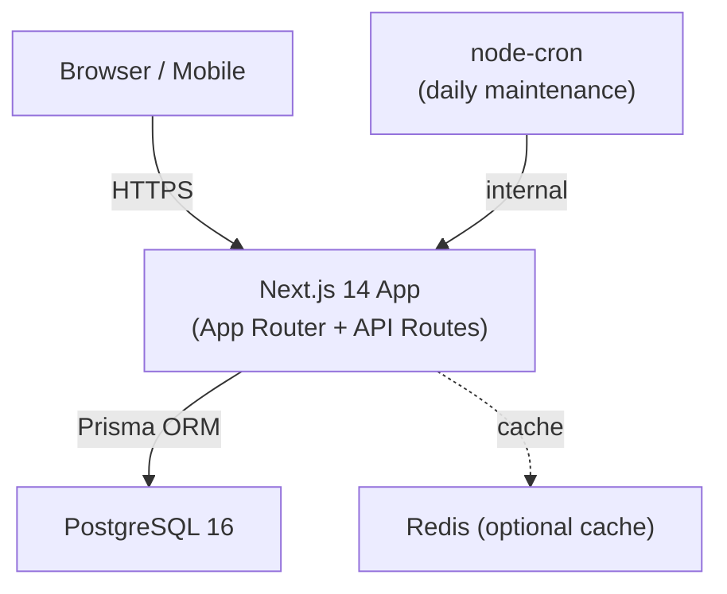
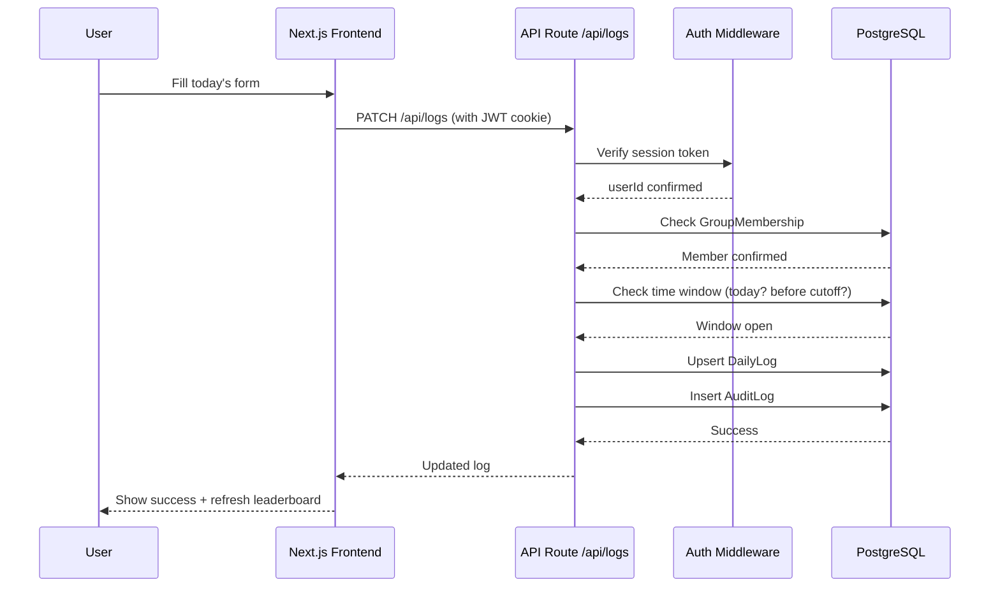
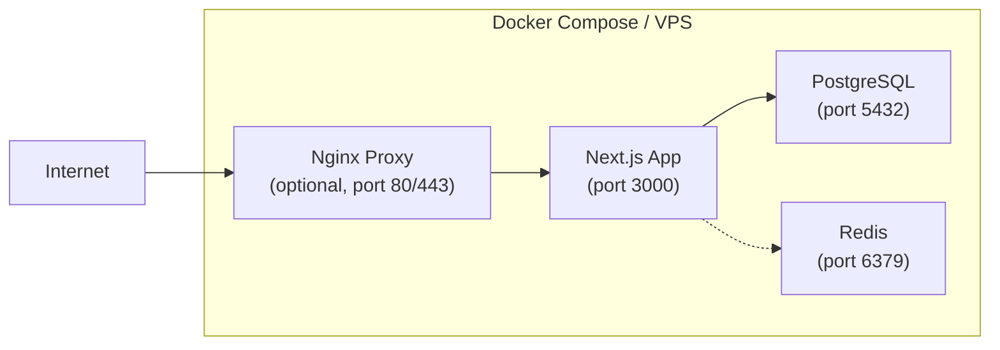

# Ramadan Competition Tracker — Product Requirements Document

## Executive Summary
A multi-tenant web application enabling groups (families, friends, classrooms) to run a Ramadan ibadah competition. Members track daily Taraweeh, Tahajjud, and Quran reading. All data is public within the group; groups are completely isolated.

---

## 1. Functional Requirements

### 1.1 Authentication & Users
- Email/password signup and login
- Optional Google OAuth (V2)
- Secure sessions via JWT (HttpOnly cookies)
- Password hashing via bcrypt
- Email is globally unique

### 1.2 Groups (Multi-Tenant)
- Any authenticated user can create a group
- Each group has: name, slug (URL-friendly), optional logo URL, invite code, settings
- Groups are isolated — no cross-group data leakage
- Admin role: the creator; can promote other members to admin
- Invite via unique invite code (regeneratable) or direct link
- Admin can kick members, lock days, override entries

### 1.3 Daily Tracking
Per user, per group, per day:
| Field | Type | Default Cap | Notes |
|-------|------|-------------|-------|
| taraweeh_rakaat | int 0–N | 11 | configurable per group |
| tahajjud_rakaat | int 0–N | 11 | configurable per group |
| quran_pages | int 0–20 | 20 | 1 unit = 20 pages |

- Users can only log for "today" (per group timezone + reset rule)
- Edit allowed until "edit cutoff time" (default 03:00 local)
- No backfilling by default (admin override only)

### 1.4 Scoring
- PointsTaraweeh = taraweeh_rakaat (capped at group cap)
- PointsTahajjud = min(tahajjud_rakaat, tahajjud_cap)
- PointsQuran = quran_pages (0–20)
- DailyTotal = sum of three
- OverallTotal = sum of all DailyTotals

### 1.5 Leaderboards
- Daily leaderboard (per day)
- Overall leaderboard (full Ramadan)
- Weekly/last-7-days leaderboard
- Tie-breakers: OverallTotal → Quran pages → Taraweeh → Earliest timestamp
- Top 3 podium + full ranking table

### 1.6 Calendar
- Admin sets Ramadan start date (Gregorian), number of days (29/30)
- Day reset rule: Midnight (default) or Maghrib
- Timezone configurable (default: Africa/Cairo)
- System generates Day 1..N with actual dates

### 1.7 Anti-Cheat
- Users edit only own logs
- Time-based edit window enforcement (server-side)
- Admin can override with mandatory audit log entry
- Day lock prevents all edits
- Audit log: user, action, old/new values, IP, user agent, timestamp

### 1.8 Pages
1. Landing page
2. Auth (signup/login)
3. Create Group
4. Join Group (via invite code)
5. Group Dashboard (today card, calendar grid, leaderboards)
6. Member profile page
7. Admin Settings panel
8. 404/403 pages

---

## 2. Non-Functional Requirements

| Category | Requirement |
|----------|-------------|
| Security | bcrypt passwords, JWT HttpOnly, CSRF, rate limiting, input validation, group isolation |
| Performance | DB indexes on (group_id, day_number), (user_id, group_id), caching for leaderboards |
| Availability | Docker health checks, graceful shutdown |
| Accessibility | WCAG AA contrast, keyboard nav, ARIA labels |
| i18n | Arabic-first (RTL), English supported, locale switching |
| Mobile | Mobile-first design, 10-second daily update UX |
| Observability | Structured JSON logs, request IDs, audit trail |

---

## 3. V1 Scope

- Email/password auth only
- Single app (Next.js API routes + frontend)
- PostgreSQL + Prisma
- Docker Compose deployment
- Polling refresh (60s interval)
- Full leaderboard + anti-cheat
- Full RTL/Arabic support

## 4. V2 Ideas

- Google/Apple OAuth
- Push notifications (day reminder)
- WebSocket real-time updates
- Dua/dhikr tracking
- Fasting streak tracker
- Mobile app (React Native)
- Export to PDF/Excel
- Spectator link (read-only public URL)
- Group photo/avatar upload (S3)
- Admin analytics dashboard

---

## 5. Architecture

### High-Level

### Data Flow — Daily Log Update

### Deployment

---

## 6. Database Schema

See `/prisma/schema.prisma` for full Prisma schema.

Key entities:
- **User**: id, email, passwordHash, name, createdAt
- **Group**: id, name, slug, inviteCode, logoUrl, createdAt
- **GroupSettings**: ramadanStartDate, numDays, timezone, resetRule, editCutoffHour, taraweehCap, tahajjudCap
- **GroupMembership**: userId, groupId, role (ADMIN/MEMBER), joinedAt
- **DailyLog**: userId, groupId, dayNumber, taraweehRakaat, tahajjudRakaat, quranPages, updatedAt
- **AuditLog**: userId, groupId, actionType, entity, entityId, oldValue, newValue, ip, userAgent, timestamp

---

## 7. API Summary

See `/API_SPEC.md` for full spec.

Auth endpoints: POST /api/auth/signup, POST /api/auth/login, POST /api/auth/logout
Group endpoints: POST /api/groups, GET /api/groups/:slug, PUT /api/groups/:slug/settings
Member endpoints: POST /api/groups/:slug/join, DELETE /api/groups/:slug/members/:userId
Log endpoints: GET /api/groups/:slug/logs, PUT /api/groups/:slug/logs/today
Leaderboard: GET /api/groups/:slug/leaderboard
Admin: POST /api/groups/:slug/days/:day/lock
